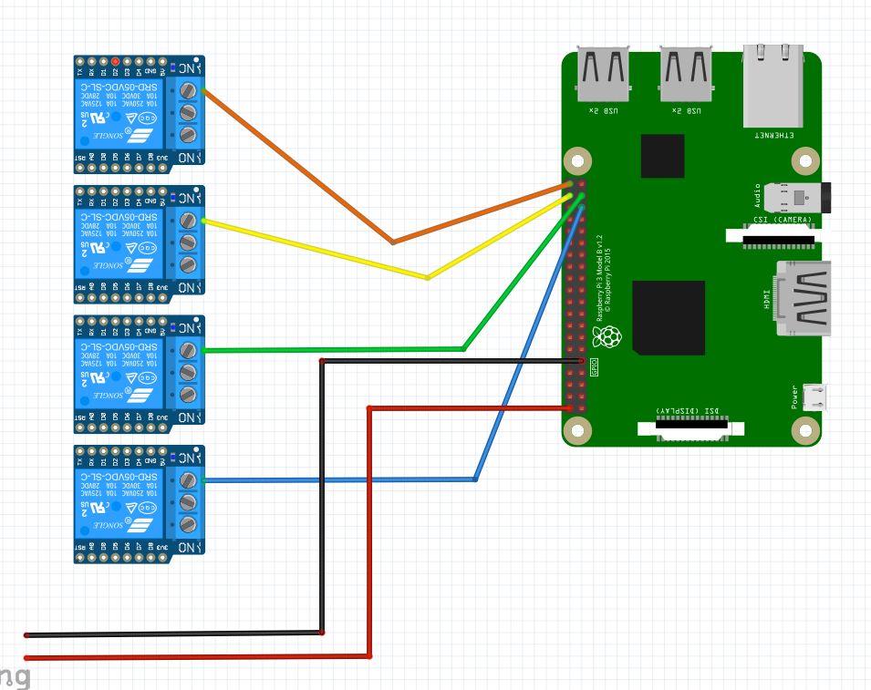

# Projet de commande de prises électriques via Raspberry

## Partie matérielle

Un boitier électrique contenant:
* 4 prises électriques
* Un relais 220V

Un Raspberry Pi contrôlant le relais et ainsi, les prises 220V

## Schéma



## Partie logicielle

Une API REST pour manipuler le relais.

URL | Description
 -- | -- 
/index | Page d'accueil
/switch/<numero de prise> | Change l'état de la prise


### Requis

* Mock.GPIO

https://github.com/codenio/Mock.GPIO

sudo apt install python3-rpi.gpio

## Routes

### API

Format: JSON

/api
GET
 Get all GPIOs state
 ```json
 [
            {
                'Prise': 1,
                'state': getGPIOState(1)
            },
            {
                'Prise': 2,
                'state': getGPIOState(2)
            },
            {
                'Prise': 3,
                'state': getGPIOState(3)
            },
            {
                'Prise': 4,
                'state': getGPIOState(4)
            }
        ]
```

/api/switch/<prise>
POST
 Switch GPIO state and returns new GPIO state
 ```json
  {
   'prise': prise_number,
   'state': 1|0
  }
  ```

/api/switch/<prise>
GET
 Get current GPIO state
 ```json
  {
   'prise': prise_number,
   'state': 1|0
  }
  ```


### Web

Format: HTML

/
Home page
Displays all current GPIOs states

/switch/<prise>
 Switch GPIO state and returns new GPIO state

## TODO

* Route pour allumer une prise pendant une durée
* Authentification
* Design des pages
